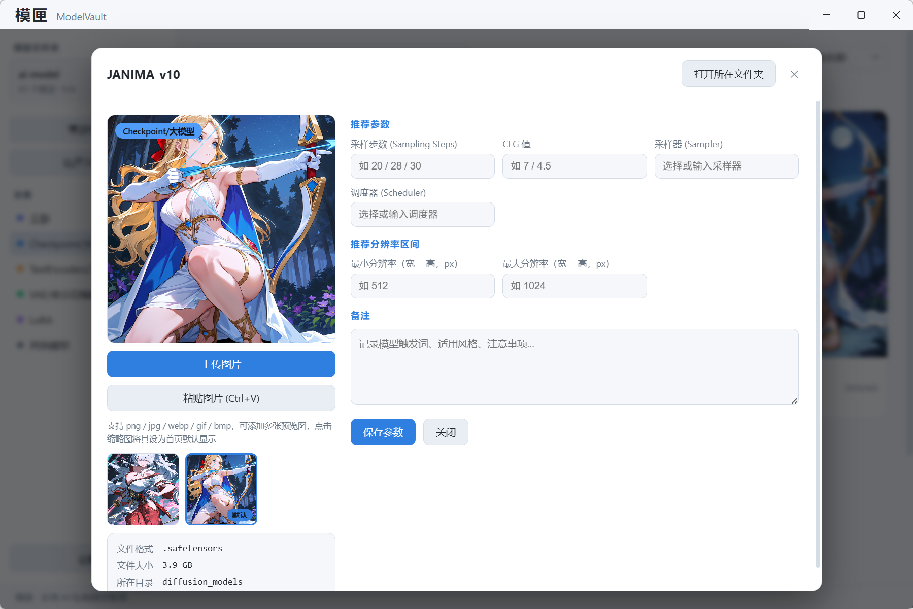

# ModelVault（模匣）

基于 **Electron + Vite + Vue 3** 的 Windows 平台本地 AI 绘画模型管理软件。

核心功能：

- **模型扫描与自动分类**：选择模型根目录后递归扫描 `.safetensors` / `.ckpt` / `.pt` / `.pth` / `.bin`，按文件夹名与文件名关键词自动分类为 Checkpoint/大模型、TextEncoders/文本编码器、VAE/变分自编码器、LoRA，其余归入「其他模型」，并支持二级分类标签（Embedding / ControlNet / 放大模型 / HyperNetwork / LoRA 角色风格等）；扫描支持进度展示与**随时取消**，可配置排除目录与扫描文件类型
- **模型浏览**：卡片式首页，**虚拟滚动**支撑数千模型流畅浏览；支持按名称/备注名/备注(触发词)/分类标签/自定义标签搜索、按分类与收藏筛选、多种排序；封面自动生成**缩略图缓存**（后台生成不阻塞扫描）
- **封面管理**：详情页上传 / Ctrl+V 粘贴 / 拖拽导入多张预览图，点击缩略图设为首页默认显示，支持删除与孤儿文件自动清理；自动识别模型同名 sidecar 预览图
- **Civitai 匹配**：计算模型文件 SHA256（AutoV2 哈希，持久化缓存避免重复计算）查询 Civitai，一键回填推荐参数、追加触发词、打开模型页面；走 Chromium 网络栈，自动继承系统代理
- **收藏 / 评分 / 自定义标签**：星标收藏、五星评分、多标签标注，即时保存，支持收藏筛选
- **模型文件管理**：重命名（联动元数据与 sidecar 文件）、删除（移入系统回收站并清理关联数据）、打开所在文件夹、复制路径/推荐参数，卡片与详情页均提供原生右键菜单
- **推荐参数**：为每个模型保存采样步数、CFG 区间、采样器、调度器、精度、推荐分辨率区间与备注
- **关联存储**：模型的封面、推荐参数、备注等用户数据统一保存在所选模型根目录的 `.modelvault/` 文件夹内，按相对路径关联，随文件夹移动/复制保持关联；不同根目录数据相互独立
- **体验细节**：亮/暗主题切换（同步原生标题栏颜色）、卡片尺寸/展示内容配置、窗口尺寸与位置记忆、原生标题栏 + 自定义拖拽区

## 界面展示

**模型浏览**：卡片式首页，左侧分类筛选与计数、顶部搜索与排序，扫描全程异步不阻塞 UI。


**模型详情**：上传/粘贴封面图片、编辑推荐参数（采样步数、CFG、采样器、调度器、推荐分辨率区间）与备注。



## 技术栈

| 组件             | 版本 | 说明                                   |
| ---------------- | ---- | -------------------------------------- |
| Electron         | ^44  | 跨平台桌面运行时                       |
| electron-vite    | ^5   | 构建/开发工具链，内置 HMR 热重载       |
| Vue 3            | ^3.5 | 渲染进程前端框架                       |
| electron-builder | ^26  | Windows 打包（portable 单文件便携版）  |
| vitest           | ^3   | 单元测试（主进程纯逻辑）               |

## 快速开始

```bash
# 1. 安装依赖
npm install

# 2. 启动开发模式（热重载）
npm start
```

## 项目结构

```
ModelVault/
├── image/                        # 软件界面截图（README 展示用）
├── src/
│   ├── main/                     # 主进程
│   │   ├── index.js              # 应用入口：生命周期、单实例锁、全局错误处理
│   │   ├── windows/
│   │   │   └── mainWindow.js     # 主窗口创建/管理（窗口状态记忆、WCO 标题栏）
│   │   ├── menu.js               # 窗口级快捷键（无原生菜单栏模式）
│   │   ├── ipc.js                # IPC 处理器注册入口（应用信息/主题/异常上报）
│   │   ├── ipc/
│   │   │   └── models.js         # 模型管理 IPC 处理器（扫描/封面/文件管理/右键菜单）
│   │   ├── protocol.js           # mvimg:// 自定义图片协议（路径白名单校验）
│   │   ├── theme.js              # 主题颜色常量（主进程共用）
│   │   ├── logger.js             # 日志模块（按天分文件，保留 14 天）
│   │   └── services/
│   │       ├── scanner.js        # 模型扫描与自动分类（支持取消）
│   │       ├── store.js          # 关联存储（元数据存于模型根目录 .modelvault/，原子写入）
│   │       ├── covers.js         # 封面图片选择/粘贴/拖拽保存与孤儿清理
│   │       ├── thumbs.js         # 封面缩略图缓存（扫描后异步生成）
│   │       └── civitai.js        # Civitai 哈希匹配（net.fetch，继承系统代理）
│   ├── preload/
│   │   └── index.js              # 预加载脚本：contextBridge + IPC 通道白名单
│   └── renderer/                 # 渲染进程（Vue 3）
│       ├── index.html            # HTML 入口（含 CSP）
│       └── src/
│           ├── main.js           # Vue 应用入口（全局错误兜底上报）
│           ├── App.vue           # 根组件（整体布局、空状态、事件订阅）
│           ├── store/
│           │   └── appStore.js   # 全局响应式状态仓库（筛选排序/模型操作）
│           ├── components/
│           │   ├── TopBar.vue            # 标题栏（品牌区 + 原生窗口控件叠加层）
│           │   ├── Sidebar.vue           # 侧栏：文件夹信息/操作按钮/分类筛选
│           │   ├── VirtualModelGrid.vue  # 虚拟滚动模型网格
│           │   ├── ModelCard.vue         # 模型卡片（封面、类型、收藏、参数摘要）
│           │   ├── ModelDetail.vue       # 详情弹层：封面管理 + 参数表单 + 文件管理
│           │   ├── SettingsPage.vue      # 设置页（占据模型预览区）
│           │   └── ToastHost.vue         # 轻提示通知
│           └── assets/styles/    # 全局样式
├── tests/                        # vitest 单元测试（scanner / store 纯逻辑）
├── electron.vite.config.mjs      # electron-vite 配置
├── electron-builder.yml          # 打包配置（portable 单文件）
└── package.json
```

## 常用脚本

| 命令                        | 说明                                            |
| --------------------------- | ----------------------------------------------- |
| `npm start` / `npm run dev` | 启动开发模式（主进程/渲染进程热重载）           |
| `npm run build`             | 编译主进程、preload、渲染进程到 `out/`          |
| `npm test`                  | 运行单元测试（vitest，`test:watch` 为监视模式） |
| `npm run preview`           | 以生产构建产物启动应用预览                      |
| `npm run dist`              | 编译并打包单文件便携版 EXE 到 `dist/{version}/` |
| `npm run dist:dir`          | 编译并生成免安装目录（快速验证打包结果）        |

## 开发指南

### 主进程与渲染进程通信

渲染进程**没有**裸 `invoke` 入口，所有通道必须经白名单注册：

1. 在 `src/main/ipc.js` 或 `src/main/ipc/models.js` 中注册处理器：

```js
ipcMain.handle("my:channel", (event, payload) => {
  return "result";
});
```

2. 在 `src/preload/index.js` 中将通道加入 `VALID_INVOKE_CHANNELS` 白名单
   （事件推送类通道加入 `VALID_RECEIVE_CHANNELS`）。

3. 在 `src/preload/index.js` 的 `api` 对象中添加语义化方法
   （内部统一走 `invokeValidated` / `subscribe`）：

```js
const api = {
  myDomain: {
    doThing: (payload) => invokeValidated("my:channel", payload),
    onThing: (listener) => subscribe("my:event", listener)
  }
};
```

4. 渲染进程中通过 `window.api.myDomain.doThing(payload)` 调用。

### 窗口管理

窗口统一在 `src/main/windows/` 目录管理，可参照 `mainWindow.js` 创建多窗口。

### 快捷键

应用不显示原生菜单栏，快捷键在 `src/main/menu.js` 中通过 `before-input-event`
在窗口级别注册：`F11` 全屏切换；`Ctrl+Shift+I` 开发者工具与 `Ctrl+R` /
`Ctrl+Shift+R` 刷新**仅在开发环境生效**，打包发布版不注册。

### 日志

- 日志位置：`%APPDATA%\modelvault\logs\modelvault-YYYY-MM-DD.log`（按天分文件，保留 14 天）
- 用法：`import logger from './logger'` 后调用 `logger.info / warn / error`
- 主进程全局异常（`uncaughtException` / `unhandledRejection`）自动记录；
  渲染进程异常经 `app:reportError` 通道上报并写入同一日志

### 测试

单元测试位于 `tests/`，仅覆盖主进程无 UI 纯逻辑（扫描分类、元数据规范化、
路径关联等）；Electron API 在 `tests/setup.js` 中统一 mock。新增纯函数
模块时请同步补充用例，运行 `npm test` 验证。

## 打包说明

- 打包配置见 `electron-builder.yml`（portable 单文件便携版，x64），产物为 `dist/{version}/ModelVault-{version}.exe`（版本号随 `package.json` 自动生成）
- 单文件 EXE 运行时不在其所在目录生成任何文件：设置与日志保存在 `%APPDATA%\modelvault\`，模型元数据保存在用户选择的模型文件夹
- 首次启动需解压到系统临时目录，启动速度略慢于常规安装版
- 如需自定义应用图标，将 `icon.ico`（256×256 及以上）放入 `build/` 目录
- Windows 10 及以上版本可直接运行，无额外运行时依赖

## 安全要点

- `contextIsolation: true` + `nodeIntegration: false` + `sandbox: true`，渲染进程无 Node 能力
- preload 仅暴露白名单通道（执行层校验），防止任意 IPC 调用
- `mvimg://` 图片协议仅允许访问当前模型根目录内的文件（路径越界返回 403）
- 渲染进程导航请求一律拦截，外部链接通过系统浏览器打开
- 模型删除移入系统回收站（非永久删除），封面删除有路径越界防护
- HTML 含 CSP 策略；开发类快捷键（DevTools/刷新）在生产环境禁用
