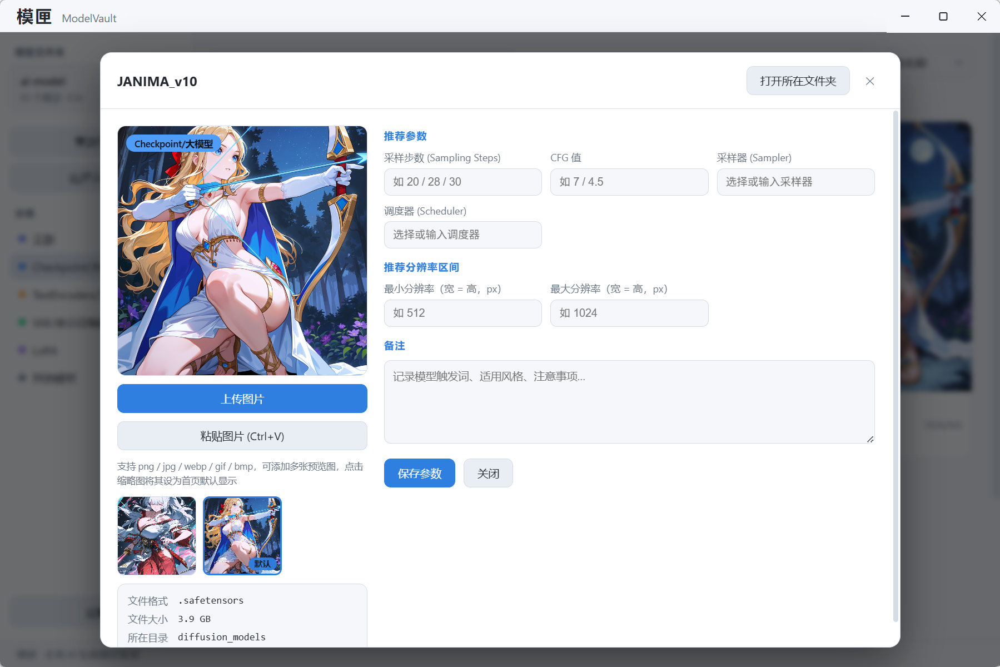

# ModelVault（模匣）

基于 **Electron + Vite + Vue 3** 的 Windows 平台本地 AI 绘画模型管理软件。

核心功能：

- **模型扫描与自动分类**：选择模型根目录后递归扫描 `.safetensors` / `.ckpt` / `.pt` / `.pth` / `.bin`，按文件夹名与文件名关键词自动分类为 Checkpoint/大模型、TextEncoders/文本编码器、VAE/变分自编码器、LoRA，其余归入「其他模型」，并支持二级分类标签（Embedding / ControlNet / 放大模型 / HyperNetwork / LoRA 角色风格等）；扫描支持进度展示与**随时取消**，可配置排除目录与扫描文件类型
- **模型浏览**：卡片式首页，**虚拟滚动**支撑数千模型流畅浏览；支持按名称/备注名/备注(触发词)/分类标签搜索、按分类与收藏筛选、多种排序；封面自动生成**缩略图缓存**（后台生成不阻塞扫描）
- **封面管理**：详情页上传 / Ctrl+V 粘贴 / 拖拽导入多张预览图，点击缩略图设为首页默认显示，支持删除与孤儿文件自动清理；自动识别模型同名 sidecar 预览图
- **收藏 / 评分**：星标收藏、五星评分、NSFW 标记，即时保存，支持收藏筛选
- **批量管理**：多选模式（卡片勾选 + 全选）批量收藏/评分/NSFW/分类标签/移入回收站，复用既有单模型校验与持久化管线
- **重复检测**：按文件大小粗筛 + SHA256 精确比对（复用已持久化的哈希缓存，GB 级文件不重算），重复分组支持定位与清理
- **多模型库**：保存多个模型根目录（上限 20），侧栏一键切换；每个库的元数据/封面相互独立（各自 `.modelvault/`）
- **目录监控**：可选开启「目录变更时自动重扫」（3 秒防抖），模型文件夹增删文件后列表自动刷新，关联存储写入不会误触发
- **模型文件管理**：删除（移入系统回收站并清理关联数据）、打开所在文件夹、复制路径/推荐参数，卡片与详情页均提供原生右键菜单
- **列表导出**：当前筛选结果一键导出 CSV（带 BOM，Excel 直接打开）或 JSON，含备注、推荐参数、收藏/评分等全部标注
- **应用内检查更新**：设置页一键查询 GitHub Releases 最新版本，有更新时提供下载页直达链接
- **推荐参数**：为每个模型保存采样步数、CFG 区间、采样器、调度器、精度、推荐分辨率区间与备注
- **关联存储**：模型的封面、推荐参数、备注等用户数据统一保存在所选模型根目录的 `.modelvault/` 文件夹内，按相对路径关联，随文件夹移动/复制保持关联；不同根目录数据相互独立
- **数据备份**：一键将应用设置与当前模型库的标注（备注/参数/收藏/评分）及封面打包为 zip，可随时恢复到任意模型文件夹（缩略图缓存不纳入；覆盖恢复时旧数据自动留 .bak）
- **体验细节**：亮/暗主题切换（同步原生标题栏颜色）、卡片尺寸/展示内容配置、窗口尺寸与位置记忆、原生标题栏 + 自定义拖拽区

## 界面展示

**模型浏览**：卡片式首页，左侧分类筛选与计数、顶部搜索与排序，扫描全程异步不阻塞 UI。


**模型详情**：上传/粘贴封面图片、编辑推荐参数（采样步数、CFG、采样器、调度器、推荐分辨率区间）与备注。



## 技术栈

| 组件             | 版本 | 说明                                   |
| ---------------- | ---- | -------------------------------------- |
| Electron         | ^44  | 跨平台桌面运行时                       |
| electron-vite    | ^5   | 构建/开发工具链，内置 HMR 热重载       |
| Vue 3            | ^3.5 | 渲染进程前端框架                       |
| electron-builder | ^26  | Windows 打包（portable 单文件便携版）  |
| Vite             | ^7   | 底层构建引擎                           |
| vitest           | ^5   | 单元测试（主进程纯逻辑）               |

## 目录

- [技术栈](#技术栈)
- [快速开始](#快速开始)
- [项目结构](#项目结构)
- [常用脚本](#常用脚本)
- [开发指南](#开发指南)
- [打包说明](#打包说明)
- [安全要点](#安全要点)

## 快速开始

环境要求：Windows 10 及以上，Node.js ≥ 20.19（推荐 22 LTS）。

```bash
# 1. 安装依赖
npm install

# 2. 启动开发模式（热重载）
npm start
```

## 项目结构

```
ModelVault/
├── image/                        # 软件界面截图（README 展示用）
├── src/
│   ├── main/                     # 主进程
│   │   ├── index.js              # 应用入口：生命周期、单实例锁、全局错误处理
│   │   ├── windows/
│   │   │   └── mainWindow.js     # 主窗口创建/管理（窗口状态记忆、WCO 标题栏）
│   │   ├── menu.js               # 窗口级快捷键（无原生菜单栏模式）
│   │   ├── ipc.js                # IPC 处理器注册入口（应用信息/主题/异常上报）
│   │   ├── ipc/
│   │   │   └── models/           # 模型管理 IPC 处理器（按域拆分模块）
│   │   │       ├── index.js      #   注册入口
│   │   │       ├── scan.js       #   扫描（进度推送/取消/防重入）
│   │   │       ├── decorate.js   #   扫描结果装饰（封面/缩略图/元数据/sidecar/safetensors）
│   │   │       ├── covers.js     #   封面链路（上传/粘贴/拖拽/设默认/删除）
│   │   │       ├── meta.js       #   元数据链路（标注保存/快捷标记）
│   │   │       ├── misc.js       #   文件管理/右键菜单/复制参数
│   │   │       ├── store.js      #   存储与设置链路（loadStore/chooseFolder/settings:update）
│   │   │       └── model-state.js#   跨模块状态（装饰缓存/缩略图后台任务）
│   │   ├── protocol.js           # mvimg:// 自定义图片协议（路径白名单校验）
│   │   ├── theme.js              # 主题颜色常量（主进程共用）
│   │   ├── logger.js             # 日志模块（按天分文件，保留 14 天）
│   │   └── services/
│   │       ├── scanner.js        # 模型扫描与自动分类（支持取消）
│   │       ├── store.js          # 关联存储（元数据存于模型根目录 .modelvault/，原子写入）
│   │       ├── covers.js         # 封面图片选择/粘贴/拖拽保存与孤儿清理
│   │       ├── thumbs.js         # 封面缩略图缓存（扫描后异步生成）
│   │       ├── safetensors.js    # safetensors 头部解析（kohya/modelspec 训练元信息）
│   │       └── hash.js           # 文件 SHA256 流式计算（重复检测复用）
│   ├── preload/
│   │   └── index.js              # 预加载脚本：contextBridge + IPC 通道白名单
│   └── renderer/                 # 渲染进程（Vue 3）
│       ├── index.html            # HTML 入口（含 CSP）
│       └── src/
│           ├── main.js           # Vue 应用入口（全局错误兜底上报）
│           ├── App.vue           # 根组件（整体布局、空状态、事件订阅）
│           ├── store/
│           │   └── appStore.js   # 全局响应式状态仓库（筛选排序/模型操作）
│           ├── components/
│           │   ├── TopBar.vue            # 标题栏（品牌区 + 原生窗口控件叠加层）
│           │   ├── Sidebar.vue           # 侧栏：文件夹信息/操作按钮/分类筛选
│           │   ├── VirtualModelGrid.vue  # 虚拟滚动模型网格
│           │   ├── ModelCard.vue         # 模型卡片（封面、类型、收藏、参数摘要）
│           │   ├── ModelDetail.vue       # 详情弹层：封面管理 + 参数表单 + 文件管理
│           │   ├── SettingsPage.vue      # 设置页（占据模型预览区）
│           │   └── ToastHost.vue         # 轻提示通知
│           └── assets/styles/    # 全局样式
├── tests/                        # vitest 单元测试（主进程纯逻辑 + IPC handler + 渲染层 store 与组件）
├── electron.vite.config.mjs      # electron-vite 配置
├── electron-builder.yml          # 打包配置（portable 单文件）
└── package.json
```

## 常用脚本

| 命令                        | 说明                                            |
| --------------------------- | ----------------------------------------------- |
| `npm start` / `npm run dev` | 启动开发模式（主进程/渲染进程热重载）           |
| `npm run build`             | 编译主进程、preload、渲染进程到 `out/`          |
| `npm test`                  | 运行单元测试（vitest，`test:watch` 为监视模式） |
| `npm run preview`           | 以生产构建产物启动应用预览                      |
| `npm run dist`              | 编译并打包单文件便携版 EXE 到 `dist/{version}/` |
| `npm run dist:dir`          | 编译并生成免安装目录（快速验证打包结果）        |

## 开发指南

### 主进程与渲染进程通信

渲染进程**没有**裸 `invoke` 入口，所有通道必须经白名单注册：

1. 在 `src/main/ipc.js` 或 `src/main/ipc/models/` 对应域模块中注册处理器：

```js
ipcMain.handle("my:channel", (event, payload) => {
  return "result";
});
```

2. 在 `src/preload/index.js` 中将通道加入 `VALID_INVOKE_CHANNELS` 白名单
   （事件推送类通道加入 `VALID_RECEIVE_CHANNELS`）。

3. 在 `src/preload/index.js` 的 `api` 对象中添加语义化方法
   （内部统一走 `invokeValidated` / `subscribe`）：

```js
const api = {
  myDomain: {
    doThing: (payload) => invokeValidated("my:channel", payload),
    onThing: (listener) => subscribe("my:event", listener)
  }
};
```

4. 渲染进程中通过 `window.api.myDomain.doThing(payload)` 调用。

### 窗口管理

窗口统一在 `src/main/windows/` 目录管理，可参照 `mainWindow.js` 创建多窗口。

### 快捷键

应用不显示原生菜单栏，快捷键在 `src/main/menu.js` 中通过 `before-input-event`
在窗口级别注册：`F11` 全屏切换；`Ctrl+Shift+I` 开发者工具与 `Ctrl+R` /
`Ctrl+Shift+R` 刷新**仅在开发环境生效**，打包发布版不注册。

### 日志

- 日志位置：`%APPDATA%\modelvault\logs\modelvault-YYYY-MM-DD.log`（按天分文件，保留 14 天）
- 用法：`import logger from './logger'` 后调用 `logger.info / warn / error`
- 主进程全局异常（`uncaughtException` / `unhandledRejection`）自动记录；
  渲染进程异常经 `app:reportError` 通道上报并写入同一日志

### 测试

单元测试位于 `tests/`：

- **主进程纯逻辑与 IPC handler**：扫描分类、元数据规范化、路径关联、原子写入等（node 环境）；
- **渲染层 store**：`tests/appStore.test.js`（筛选/排序/批量操作/占用统计/智能清理等）；
- **渲染层组件交互**：`tests/modelCard.test.js`、`topBar.test.js`、`dedupePanel.test.js`、`sidebar.test.js`，基于 `@vue/test-utils` + jsdom（文件头 `// @vitest-environment jsdom` 声明 DOM 环境，通用装配见 `tests/helpers/componentTest.js`）。

Electron API 在 `tests/setup.js` 中统一 mock。新增纯函数模块或组件交互时请同步补充用例，运行 `npm test` 验证。

## 打包说明

- 打包配置见 `electron-builder.yml`（portable 单文件便携版，x64），产物为 `dist/{version}/ModelVault-{version}.exe`（版本号随 `package.json` 自动生成）
- 单文件 EXE 运行时不在其所在目录生成任何文件：设置与日志保存在 `%APPDATA%\modelvault\`，模型元数据保存在用户选择的模型文件夹
- 首次启动需解压到系统临时目录，启动速度略慢于常规安装版
- 如需更换应用图标，替换 `build/icon.ico`（256×256 及以上；可运行 `node scripts/generate-icon.mjs` 重新生成默认图标）
- Windows 10 及以上版本可直接运行，无额外运行时依赖

## 安全要点

- `contextIsolation: true` + `nodeIntegration: false` + `sandbox: true`，渲染进程无 Node 能力
- preload 仅暴露白名单通道（执行层校验），防止任意 IPC 调用
- `mvimg://` 图片协议仅允许访问当前模型根目录内的文件（路径越界返回 403）
- 渲染进程导航请求一律拦截，外部链接通过系统浏览器打开
- 模型删除移入系统回收站（非永久删除），封面删除有路径越界防护
- HTML 含 CSP 策略；开发类快捷键（DevTools/刷新）在生产环境禁用
